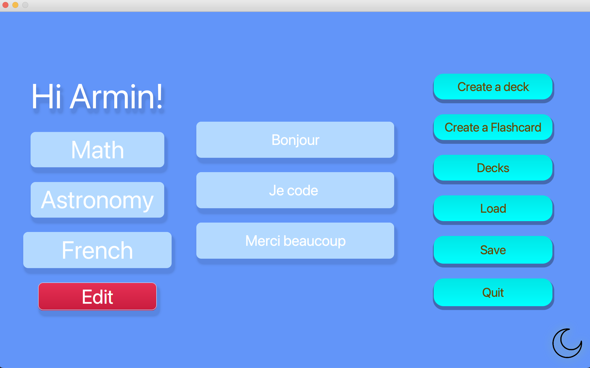

[github](https://github.com/armintalaie/FlashCardApp)

**What will the application do?**

- List of Flash Cards
- List of Decks that hold Cards
- create flashcards
- create decks
- review your flash cards

**Who will use it:**

- anyone who wants to study/memorize something
  - students
  - teachers
  - ...

**Why is this project of interest to you?**  
For a lot of courses and classes there are a big chunk od the course that needs intensive
revision and using flash cards can be really helpful
some very good and some very basic.
 

#### User Stories

- As a user, I want to create decks
- As a user, I want to create flashcards
- As a user, I want to use flash cards in decks
  - add a card to a deck
  - remove a card from a deck
- As a user, I want to see the answer of a card
- As a user, I want to be able to save my account which contains decks and cards
- As a user, I want to be the app to save my account automatically when I quit the app
- As a user, I want to be able to optionally load my saved decks and cards when I type my name

- As a user, I want to be able to switch to dark mode and normal

**Phase 4: Task 2**

- option 1: Test and design a class that is robust. You must have at least one method that throws a checked exception. You must have one test for the case where the exception is expected and another where the exception is not expected.
- FlashCard Class is the class that has been designed to be robust
  - it checks where the flashcard app front and back are shorter than MAX_CARD_LENGTH or not

**Phase 4: Task 3**

- change 1: coupling
- I fixed the problem in the GUI class where changing the width and height would cause problems since the size of the buttons wouldn't change.
  - I made constants for width and height and the buttons are created based on them
- change 2: cohesion
- I improved the cohesion in GUI class:
  - initially, GUI handled everything from inputs to design and handling information
  - the app has 3 main columns.
    - I created an abstract class(Box) and created 3 other classes(Center,Right,Left) extending Box that help break down the responsibilities of the GUI class
    - Center handles main buttons such as creating decks,saving,loading
    - Right handles getting card input and showing flashcards
    - Left handles showing decks and deleting them
    - the Gui handled the animations,rotations,background and the data the other classes need to access
    - the classes took more time to implement but because of this it's easier to understand the classes functionality and GUI isn't doing everything
