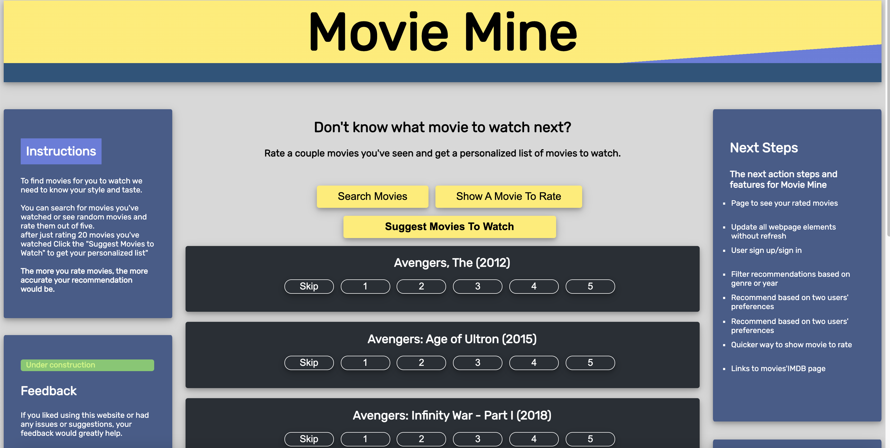
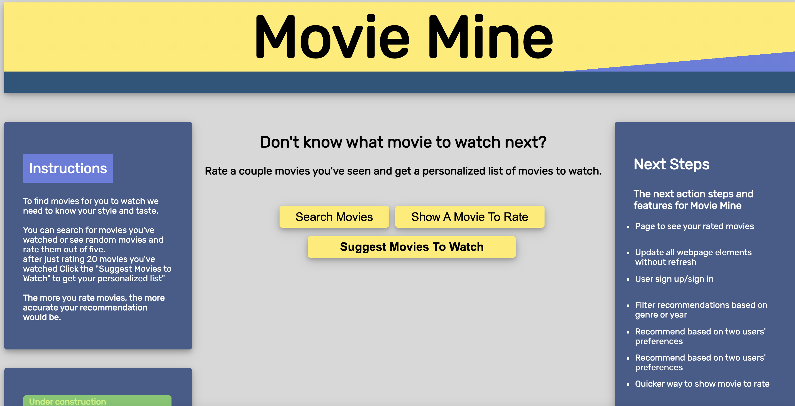

[github](https://github.com/armintalaie/Movie-Recommender-Program)
[website](https://warm-escarpment-24705.herokuapp.com/)

## What this does:

- User can input movie rating of movies they have watched:
  - searching and rating
  - random movie suggestions to rate
- Using the app's algorithm, it will provide the user with movies to watch next based on the movies rated

## How this program does it:

- It is based on a 25million input database of movies and user ratings
- The database is sorted, filtered and modified to remove unwanted data
- After input and rating collection from user a machine learning collaborate filtering/matrix factorization is applied

## Technical breakdown of project:

- Pandas and Python are used to extract and classify the data
- User-friendly website is implemented using HTML,CSS and JavaScript
- Data is collected from the user and stored
- Imported "Lenskit" Machine learning algorithms are fitted to the data from the user and our dataset to find neighbors
- The algorithm, and website is developed and combined using Django
