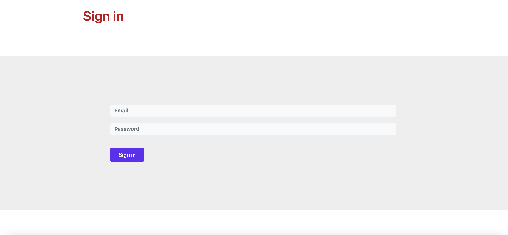
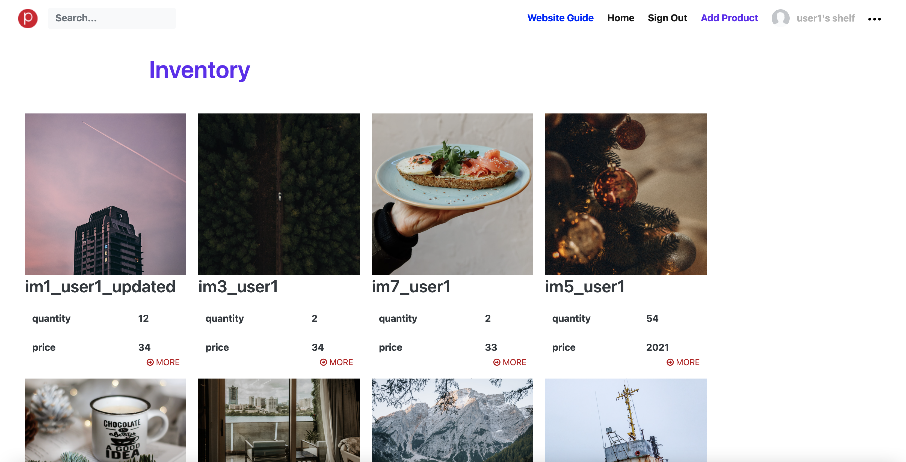

[Github](https://github.com/armintalaie/Shelf)
[Website](https://guarded-coast-71095.herokuapp.com/)

## Description

Website, where visitors can browse for products and search for them. Visitors can sign up, and create their own products and upload photos for them. Users can set public, private status to their products to allow them to be visible on the home page or not.

## Technical walkthrough:

I created an express app. I created user and product models using Mongoose and stored the on MongoDB. I utilized Passport.js to authenticate user and encrypt user passwords. I deployed the web app on Heroku.

## Next Actions

Moving forward, I want to optimize MongoDB access to fetch user products faster, implement machine learning on images to find similar products to a single product. Additionally, I want to implement Stripe's payment API for users to be able to buy/sell products.
